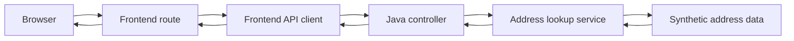

# How the service works

Use this guide to investigate behaviour by following a request from the browser, through the
frontend and into the Java API. You do not need to understand every file before starting. Choose
one visible behaviour and trace only the path involved.

## Start with something you can observe

Run both applications using the [README](../README.md), then try:

- <http://localhost:3000/address> for the postcode form;
- `BT9 7EP` to see several fictional addresses;
- `ZZ1 1ZZ` to see one fictional address;
- another postcode to see the no-results page; and
- <http://localhost:8080/api/health> to request the API directly.

When you open a URL, the browser sends an **HTTP request** and receives an HTTP response. A path
such as `/address` identifies the requested behaviour. The method describes the kind of request:
`GET` asks for information, while `POST` submits form data.

## Request path at a glance



The browser never calls the Java API during the journey. It submits the postcode to the frontend,
which keeps journey state in a session and calls the API on the user's behalf. The API looks up
fixed fictional data and sends JSON back. The frontend uses that response to produce HTML for the
browser.

The diagram is a map, not a replacement for the code. Follow the numbered steps below when you
need to understand where a value changes or an error begins.

## Code map

```text
frontend/
├── src/
│   ├── server.ts                 starts the HTTP server
│   ├── app.ts                    configures the frontend and its dependencies
│   ├── address-api-client.ts     calls and checks the Java address API
│   ├── routes/address.ts         handles postcode and address-selection requests
│   └── types/express-session.d.ts describes journey state stored in the session
├── views/
│   ├── address.njk               postcode form
│   ├── select-address.njk        results, selection and validation
│   ├── address-lookup-error.njk  unavailable-service message
│   └── address-confirmed.njk     selected-address confirmation
└── test/
    ├── address.test.ts            checks the browser journey over HTTP
    └── address-api-client.test.ts checks the frontend-to-API boundary

api/src/
├── main/java/com/example/brightstart/training/
│   ├── TrainingApiApplication.java starts Spring Boot
│   ├── health/                      contains the health endpoint
│   └── address/
│       ├── AddressController.java   handles GET /api/addresses
│       ├── AddressLookupService.java chooses the synthetic result
│       ├── Address.java             describes one address
│       └── AddressLookupResponse.java describes the JSON response
└── test/java/com/example/brightstart/training/
    ├── health/HealthControllerTest.java
    └── address/AddressControllerTest.java
```

A `.ts` file is TypeScript, `.njk` is a Nunjucks template and `.java` is Java.

## Follow the postcode and address journey

1. `GET /address` renders the postcode form from `address.njk`.
2. The form sends the entered value to `POST /address`.
3. The route trims the value, changes letters to uppercase and stores the postcode in the session.
4. A `303` redirect asks the browser to make a new `GET /select-address` request.
5. The selection route reads the postcode from the session and asks `address-api-client.ts` for
   addresses.
6. The client sends `GET /api/addresses?postcode=...` to the Java API.
7. `AddressController` passes the postcode to `AddressLookupService`.
8. The service returns the matching fictional addresses. Spring **serialises** the Java records,
   converting them into JSON for the HTTP response.
9. The frontend checks the response and renders the addresses as radio buttons, allowing one
   choice.
10. `POST /select-address` checks that the submitted ID belongs to an address returned by the API,
    then stores that complete address in the session.
11. A final `303` redirect displays the stored address at `GET /address-confirmed`.

A **session** is state kept on the server for one browser journey. `express-session` gives the
browser a cookie containing a session identifier; the postcode and address remain in frontend
memory. Restarting the frontend clears them because this training service has no database.

The redirects use the POST/Redirect/GET pattern. Refreshing the result page repeats only the final
`GET`, rather than submitting the form again.

## The address API contract

The frontend requests `GET /api/addresses?postcode=BT9%207EP`. A successful response has one
`addresses` array. Each item has the same five named fields:

```json
{
  "addresses": [
    {
      "id": "bt9-7ep-1",
      "line1": "1 Apprentice Avenue",
      "line2": "Learning Quarter",
      "town": "Belfast",
      "postcode": "BT9 7EP"
    }
  ]
}
```

That agreed response shape is an **API contract**. The Java records define what the API sends, and
the TypeScript types plus response checks define what the frontend accepts. No match is still a
successful response with an empty array. The controlled failure returns HTTP status `503` instead.

## Follow a failure

Different outcomes have deliberately different meanings:

| Input or action                      | Result                                         |
| ------------------------------------ | ---------------------------------------------- |
| Empty postcode                       | Frontend validation error                      |
| `BT9 7EP`                            | Three fictional addresses                      |
| `ZZ1 1ZZ`                            | One fictional address                          |
| An unrecognised postcode             | Successful API response with no addresses      |
| `ZZ9 9ZZ`                            | Deliberate API `503 Service Unavailable`       |
| Continue without choosing an address | Frontend validation error                      |
| Stop the API before searching        | Frontend displays the unavailable-service page |

The controlled failure is fixed rather than random, so learners and tests can reproduce it. No
postcode is sent to an external service and none of these results comes from real address data.

When the API returns an unsuccessful status, returns unexpected JSON or cannot be reached, the
frontend deliberately shows the same safe message. Technical details stay in the application
boundary rather than being displayed to the user.

## Request the API directly with Bruno

The `bruno` folder contains local requests for health, multiple addresses, one address, no results
and the controlled failure. Bruno is an API client: it lets you send a request and inspect the raw
response without going through the frontend.

Start the Java API, open the `bruno` folder as a collection in the Bruno application, then run one
request. Compare its URL, status and JSON with `AddressControllerTest`. The collection contains no
credentials and its `baseUrl` points only to `localhost`.

Using Bruno is optional for running the service. Do not install a global command-line tool merely
to run the normal automated checks.

## Pause or record a request

A **breakpoint** tells a debugger to pause so you can inspect current values. Useful places include
the `GET /select-address` handler, `AddressLookupClient.findAddresses` and
`AddressController.findAddresses`.

You can also add a temporary `console.log` in TypeScript. Refresh the page and read the frontend
terminal. Remove temporary diagnostic output before committing unless it has a lasting purpose.

## Why some files are separate

`app.ts` configures Express without opening a port, while `server.ts` starts the real server. Tests
can therefore use the configured application without competing for port 3000.

`address-api-client.ts` owns HTTP communication and response checking. The route owns browser
behaviour and session state. In tests, a small replacement client returns a chosen result so route
tests remain reliable without a Java process. This is a boundary with a concrete purpose, not a
general layer for every function.

The API has a controller and a service because they answer different questions: the controller
defines the HTTP contract; the service decides which addresses a postcode produces. There is no
repository or database abstraction because no persistent data source exists.

## Configuration

The frontend calls `http://localhost:8080` by default. Set `ADDRESS_API_BASE_URL` only when the API
really runs elsewhere. No configuration framework or API key is required.

GOV.UK Frontend supplies accessible components and styles, but the service uses its own generic
branding. Node module resolution locates the installed package whether npm places it in the
frontend workspace or hoists it to the repository root.

## When the behaviour is unclear

Write down the request, the result you expected and the result you observed. Reproduce it, choose
the smallest relevant test, then trace one arrow in the diagram at a time. The
[testing guide](testing.md) explains focused tests, and the
[troubleshooting guide](troubleshooting.md) helps you collect evidence before asking for help.
