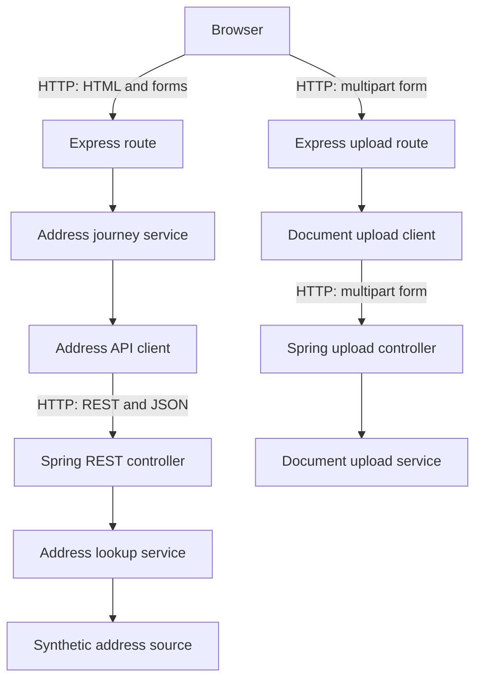

# How the service works

Use this guide to investigate behaviour by following a request from the browser, through the
frontend and into the Java API. You do not need to understand every file before starting. Choose
one visible behaviour and trace only the path involved.

## Start with something you can observe

Run both applications using the [README](../README.md), then try:

- <http://localhost:3000/address> for the postcode form;
- `BT9 7EP` to see several fictional addresses;
- `ZZ1 1ZZ` to see one fictional address;
- another postcode to see the no-results page; and
- <http://localhost:8080/api/health> to request the API directly.

When you open a URL, the browser sends an **HTTP request** and receives an HTTP response. A path
such as `/address` identifies the requested behaviour. The method describes the kind of request:
`GET` asks for information, while `POST` submits form data.

## Request path at a glance



The server-rendered Express frontend is the browser-facing application. The browser exchanges HTTP
requests, HTML pages and form data with Express. It never needs to call the Java API directly.

Express calls the Java API on the browser's behalf across a second HTTP boundary. That boundary
uses a REST endpoint and exchanges JSON rather than HTML. The API looks up fixed fictional data,
then the frontend uses the JSON response to produce the next HTML page for the browser.

The diagram is a map, not a replacement for the code. Follow the numbered steps below when you
need to understand where a value changes or an error begins.

## Code map

```text
frontend/
├── src/
│   ├── server.ts                 starts the HTTP server
│   ├── app.ts                    configures the frontend and its dependencies
│   ├── address-journey-service.ts coordinates address journey decisions
│   ├── address-api-client.ts     owns HTTP communication with the Java API
│   ├── csrf-protection.ts        protects forms from forged submissions
│   ├── document-upload-parser.ts parses one in-memory multipart upload
│   ├── document-upload-client.ts owns upload HTTP communication with the API
│   ├── domain/address.ts          describes an address inside the frontend
│   ├── domain/identity-document.ts defines the supported document choices
│   ├── domain/document-upload.ts describes accepted upload metadata
│   ├── routes/address.ts         handles postcode and address-selection requests
│   ├── routes/identity-document.ts handles document selection and guidance
│   ├── routes/document-upload.ts handles upload and confirmation requests
│   └── types/express-session.d.ts describes journey state stored in the session
├── views/
│   ├── address.njk               postcode form
│   ├── select-address.njk        results, selection and validation
│   ├── address-lookup-error.njk  unavailable-service message
│   ├── form-expired.njk          rejected-form message
│   ├── address-confirmed.njk     selected-address confirmation
│   ├── identity-document.njk     identity-document selection form
│   ├── document-guidance.njk     guidance for the selected document
│   ├── upload-document.njk       image upload form
│   ├── document-upload-error.njk unavailable-service message
│   └── document-uploaded.njk     accepted-upload confirmation
└── test/
    ├── address.test.ts                 checks browser-facing HTTP behaviour
    ├── address-journey-service.test.ts checks address-selection decisions
    ├── address-api-client.test.ts      checks the frontend-to-API boundary
    ├── identity-document.test.ts       checks selection and derived guidance
    ├── document-upload.test.ts         checks upload pages and journey state
    └── document-upload-client.test.ts  checks the multipart API boundary

api/src/
├── main/java/com/example/brightstart/training/
│   ├── TrainingApiApplication.java starts Spring Boot
│   ├── health/                      contains the health endpoint
│   ├── address/
│       ├── AddressController.java   handles GET /api/addresses
│       ├── AddressLookupService.java coordinates lookup behaviour
│       ├── SyntheticAddressSource.java owns the fixed training data
│       ├── AddressApiExceptionHandler.java produces safe API errors
│       ├── Address.java             describes one address
│       └── AddressLookupResponse.java describes the JSON response
│   └── documentupload/
│       ├── DocumentUploadController.java handles POST /api/document-uploads
│       ├── DocumentUploadService.java validates document type, size and content
│       ├── DocumentUploadReceipt.java describes accepted upload metadata
│       └── DocumentUploadExceptionHandler.java produces safe API errors
└── test/java/com/example/brightstart/training/
    ├── health/HealthControllerTest.java
    ├── address/AddressControllerTest.java
    └── documentupload/DocumentUploadControllerTest.java
```

A `.ts` file is TypeScript, `.njk` is a Nunjucks template and `.java` is Java.

## Follow the service journey

1. `GET /address` renders the postcode form from `address.njk`.
2. The form sends the entered value to `POST /address`.
3. The route trims the value, changes letters to uppercase and stores the postcode in the session.
4. A `303` redirect asks the browser to make a new `GET /select-address` request.
5. The selection route reads the postcode from the session and asks `AddressJourneyService` for
   addresses.
6. The journey service asks `address-api-client.ts`, which sends
   `GET /api/addresses?postcode=...` to the Java API.
7. `AddressController` passes the postcode to `AddressLookupService`.
8. The service normalises the postcode and asks `SyntheticAddressSource` for the fixed training
   data. Spring **serialises** the returned Java records, converting them into JSON.
9. The API client validates that JSON before returning frontend domain addresses. The route renders
   them as radio buttons.
10. For `POST /select-address`, the journey service looks up the current results again and accepts
    only the canonical address whose ID matches the submitted ID.
11. The route stores that complete address in the session, then a `303` redirect displays it at
    `GET /address-confirmed`.
12. Continuing sends the browser to `GET /identity-document`. This step is handled entirely by the
    frontend; it does not call the Java API.
13. The form submits one of the supported values to `POST /identity-document`. The route rejects
    missing or unknown values rather than trusting arbitrary form data.
14. The valid choice is stored alongside the postcode and address in the journey session. A `303`
    redirect sends the browser to `GET /document-guidance`.
15. The guidance route uses the stored document type to find the matching heading, introduction and
    requirements in `domain/identity-document.ts`, then renders them as HTML.
16. Continuing sends the browser to `GET /upload-document`. The page shows one file input and sends
    the form as `multipart/form-data` to `POST /upload-document`.
17. The frontend multipart parser accepts one file of at most 5 MB in memory. The upload route sends
    the selected document type and bytes to the Java API through `document-upload-client.ts`.
18. `DocumentUploadController` passes the multipart request to `DocumentUploadService`. The service
    checks the document type, size and leading JPEG or PNG bytes rather than trusting the filename
    or browser-supplied media type.
19. The API returns a small JSON receipt. The frontend client validates it, and the route stores
    only that metadata in the journey session.
20. A `303` redirect sends the browser to `GET /document-uploaded`, which confirms that the training
    API accepted the image without claiming that it verified the document or identity.

A **session** is state kept on the server for one browser journey. `express-session` gives the
browser a cookie containing a session identifier; the postcode, address, identity-document choice
and upload receipt remain in frontend memory. Raw file bytes are never placed in the session.
Restarting the frontend clears its journey state because this training service has no database.

The identity-document value is a constrained TypeScript type rather than an arbitrary string. The
three supported stored values are `passport`, `driving-licence` and `national-identity-card`.
Friendly labels are used when the choices are displayed to a user.

### Stored state and derived guidance


The selected document type is **stored state**: it records a fact supplied during this journey.
The guidance is **derived behaviour**: the frontend can work out what to display from that fact, so
it does not store a second copy of the guidance in the session. If the document choice changes, the
same lookup produces the new guidance on the next request.

The route does not read a document type from the guidance page's URL. This prevents a query
parameter from overriding the trusted choice held in the server-side session.

Changing the identity-document choice removes any earlier upload receipt. The old receipt describes
an image submitted for the previous choice, so retaining it would make the journey state
inconsistent.

The default in-memory session store is intentional for local training only. A deployed service
running more than one frontend instance would need a shared, durable session store so every
instance could read the same journey state. This repository does not add that infrastructure before
the training journey needs it.

Each form also contains a hidden **cross-site request forgery (CSRF) token**. The frontend stores a
matching token in the session and checks it before accepting a form submission. Another website
cannot read this token, so it cannot silently submit the form using the learner's session. A
missing or incorrect token receives a `403 Forbidden` response without running the form route.

The redirects use the POST/Redirect/GET pattern. Refreshing the result page repeats only the final
`GET`, rather than submitting the form again.

## The address API contract

The frontend requests `GET /api/addresses?postcode=BT9%207EP`. A successful response has one
`addresses` array. Each item has the same five named fields:

```json
{
  "addresses": [
    {
      "id": "bt9-7ep-1",
      "line1": "1 Apprentice Avenue",
      "line2": "Learning Quarter",
      "town": "Belfast",
      "postcode": "BT9 7EP"
    }
  ]
}
```

That agreed response shape is an **API contract**. The Java records define what the API sends, and
the TypeScript types plus response checks define what the frontend accepts. No match is still a
successful response with an empty array. The controlled failure returns HTTP status `503` and an
RFC 9457 Problem Details body with a safe public explanation instead.

## The document upload API contract

`multipart/form-data` is an HTTP request format that sends named text fields and file data together.
The frontend sends `documentType` and one field named `document` to
`POST /api/document-uploads`. The HTTP implementation creates the multipart boundary; application
code must not invent or hard-code it.

The API is the authoritative validation boundary because browser hints and frontend checks can be
bypassed. A filename and a browser-supplied media type are user-controlled metadata, not proof of
the file's contents. The deliberately narrow API check recognises only the standard leading bytes
for JPEG and PNG images. It is suitable for this learning exercise, not a general file inspection
or malware-scanning system.

A successful response has this shape:

```json
{
  "uploadId": "a generated identifier",
  "fileName": "synthetic-passport.jpg",
  "contentType": "image/jpeg",
  "size": 4
}
```

The receipt contains metadata only. The API validates the bytes in memory and does not keep them in
a database, filesystem or object store. A real document service would need access controls,
malware scanning, retention rules and dedicated durable object storage. This training service must
not be treated as production document storage.

## Follow a failure

Different outcomes have deliberately different meanings:

| Input or action                      | Result                                         |
| ------------------------------------ | ---------------------------------------------- |
| Empty postcode                       | Frontend validation error                      |
| `BT9 7EP`                            | Three fictional addresses                      |
| `ZZ1 1ZZ`                            | One fictional address                          |
| An unrecognised postcode             | Successful API response with no addresses      |
| `ZZ9 9ZZ`                            | Deliberate API `503 Service Unavailable`       |
| Continue without choosing an address | Frontend validation error                      |
| Continue without choosing a document | Frontend validation error                      |
| Submit an unknown document value     | Same safe document-selection validation error  |
| Upload no image                      | Frontend validation error                      |
| Upload more than one image           | Frontend validation error                      |
| Upload an image larger than 5 MB     | `413 Payload Too Large` with a safe error      |
| Upload content that is not JPEG/PNG  | `415 Unsupported Media Type` with a safe error |
| Stop the API before searching        | Frontend displays the unavailable-service page |
| Stop the API before uploading        | Frontend displays the upload unavailable page  |

The controlled failure is fixed rather than random, so learners and tests can reproduce it. No
postcode is sent to an external service and none of these results comes from real address data.

When the API returns an unsuccessful status, returns unexpected JSON or cannot be reached, the
frontend deliberately shows the same safe message. Technical details stay in the application
boundary rather than being displayed to the user.

## Request the API directly with Bruno

The `bruno` folder contains local requests for health, multiple addresses, one address, no results
and the controlled failure. Bruno is an API client: it lets you send a request and inspect the raw
response without going through the frontend. The collection does not include document upload:
committing a portable image fixture solely for Bruno would duplicate the tiny fixture generated by
the automated tests, while a machine-specific file path would not work for another learner.

Start the Java API, open the `bruno` folder as a collection in the Bruno application, then run one
request. Compare its URL, status and JSON with `AddressControllerTest`. The collection contains no
credentials and its `baseUrl` points only to `localhost`.

Using Bruno is optional for running the service. Do not install a global command-line tool merely
to run the normal automated checks.

## Pause or record a request

A **breakpoint** tells a debugger to pause so you can inspect current values. Useful places include
the `GET /select-address` handler, `AddressLookupClient.findAddresses` and
`AddressController.findAddresses`.

You can also add a temporary `console.log` in TypeScript. Refresh the page and read the frontend
terminal. Remove temporary diagnostic output before committing unless it has a lasting purpose.

## Why some files are separate

`app.ts` configures Express without opening a port, while `server.ts` starts the real server. Tests
can therefore use the configured application without competing for port 3000.

The route owns browser HTTP behaviour and session state. `AddressJourneyService` owns the journey's
lookup and selection decisions without depending on Express. `address-api-client.ts` owns HTTP
communication, timeouts and response checking. Route tests replace the journey-service boundary,
so they remain reliable without a Java process. Each boundary exists for a concrete responsibility;
there is no generic service framework.

The upload parser owns the browser-facing multipart limit. The document-upload client owns the
second multipart request and validates the receipt before it crosses into journey state. The Java
upload service owns authoritative content validation. These are separate because each is a real
boundary where untrusted data changes form, not because every operation needs another layer.

The API controller defines the HTTP contract, the lookup service normalises input and coordinates
the lookup, and the concrete synthetic source owns the fixed training data. There is no source
interface or repository abstraction because there is only one in-memory data source and no
persistent database.

## Configuration

The API clients call `http://localhost:8080` by default. Address requests stop waiting after three
seconds and upload requests after five seconds. Set `ADDRESS_API_BASE_URL` only when the API really
runs elsewhere. No configuration framework or API key is required.

GOV.UK Frontend supplies accessible components and styles, but the service uses its own generic
branding. Node module resolution locates the installed package whether npm places it in the
frontend workspace or hoists it to the repository root.

## When the behaviour is unclear

Write down the request, the result you expected and the result you observed. Reproduce it, choose
the smallest relevant test, then trace one arrow in the diagram at a time. The
[testing guide](testing.md) explains focused tests, and the
[troubleshooting guide](troubleshooting.md) helps you collect evidence before asking for help.
